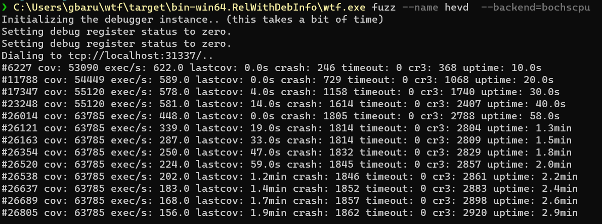

Title: Fuzzing for Windows (2) - Testing WTF and msFuzz
Date: 2024-02-20 13:00
Category: windows
Tags: windows, fuzzing
Status: draft

## Whats the Goal

We want to find the best multi-purpose fuzzers which are state-of-the-art. They are supposed to run inside of Windows or work with Windows VMs as targets.

## Last Time

We minimized our set of available fuzzers to those that could be considered good modern fuzzers by their own description.

Our choice is to test nyx/kAFL, msFuzz, WTF and LibAFL. First lets see if we get them even running and if they work as assumed. Also having an eye on the complexity of how to set them up.

## Starting with WTF

The What The Fuzz Fuzzer is our first target, mainly because the others are more interconnected (msFuzz uses kAFL, nyx is also in LibAFL, ...). Also it can run on Windows Host, which only LibAFL could also do.

The Fuzzer comes with [release binaries](https://github.com/0vercl0k/wtf/releases) for windows. It is also explaining a setup to fuzz [HEVD](https://github.com/hacksysteam/HackSysExtremeVulnerableDriver).

So we will have to prepare a Windows VM and make it to the entry of the driver somehow. I will use an Hyper-V VM, set it up for kernel debugging and will load the vulnerable x64 driver with [OSRLOADER](https://www.osronline.com/article.cfm%5Earticle=157.htm). If you have never done this, look at [this](https://voidsec.com/windows-drivers-reverse-engineering-methodology/). 

When having HEVD and WinDbg running  we can start the hevd-client.exe from wtf to trigger a break point and move some steps to break on the instruction described in the readme of wtf. Taking a Snapshot (memdump) failed for me with the provided tools for Windows 11.
I had to redo the setup for Windows 10. It also failed to run wtf, so I had to create a [ticket](https://github.com/0vercl0k/wtf/issues/195). After getting feedback I was able resolv issues with the new WinDbg and was able to run the fuzzer.

From here I witnessed bochscpu being around 300-500 execs/s, while Hyper-V just reached 12 execs/s. That is a fine speed for an emulator, strangely a VM should reach higher speeds.
The third option would be to run it in KVM, but therefore I would need a Linux System.
  

## Second round msFuzz

Lets go on with msFuzz, because it is a very specific fuzzer it should be easier to set up than nyx/kAFL to get into that kind of setups. Remember that msFuzz is build upon nyx/kAFL.

## First lessons learned

Either this fuzzer is still in an early stage or all fuzzers will be a lot of work to even get running on one target. It was needed to resolv lots of environmental issues to make the fuzzers example even work.

Though this fuzzer is able to run from inside Windows, its probably still better to run from linux. Hyper-V was slow and KVM would be better, bochscpu would run on both OSes. Therefore all fuzzers we have are Linux Host fuzzers. This is a bit anoying because I want WinDbg to Debug targets. So in the End we will need two Windows VMs, one debugging the other.
Though this fuzzer is able to run from inside Windows, its probably still better to run from linux. Hyper-V was slow and KVM would be better, bochscpu would run on both OSes. Therefore all fuzzers we have are Linux Host fuzzers. This is a bit anoying because I want WinDbg to Debug targets. So in the End we will need two Windows VMs, one debugging the other.