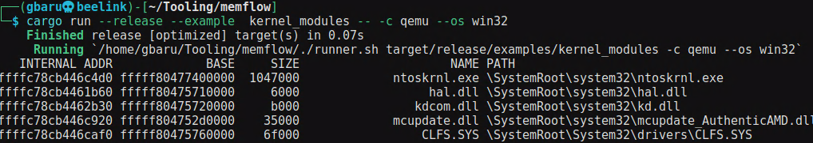

Title: Fuzzing for Windows (5) - Automation for Drivers
Date: 2024-02-20 13:00
Category: windows
Tags: windows, fuzzing
Status: draft

## Whats the Goal

1) We are looking for ways to display all running drivers
    a) get driver files
    b) Create a list of known driver to not fuzz the same drivers later
2) Find drivers registered Devices and Symlinks
    a) Also check access level if anything doesn't need admin rights
3) Find drivers DeviceIoControl & IOCTL Codes
    a) Find Access Mode of IOCTL to identify FILE_WRITE_DATA
    b) Find Communication Method to identify METHOD_BUFFERED or METHOD_IN_DIRECT
4) Have one Harness that modifies to each driver itself
    a) harness creates breakpoint before the driver function is hit
5) Create snapshot of the VM
6) Identify registers automatically? (Taint?)
7) Fuzz Script that schedules between targets
8) Fuzz

## Display all running Drivers

We can do this with memflow for qemu, kvm and a coredump

This might even give us options to interact with a target process later, so I will go along with that as part of the solution.

### Get Driver Files

### Create list of known drivers

Lets

### Generating Corpus for drivers

https://github.com/kirasys/ircap