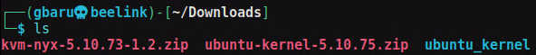
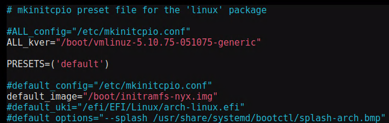

Title: Nyxing thy System
Date: 2024-03-26 13:00
Category: Fuzzing
Tags: fuzzing

Since I am running my own Arch OS, but still need capabilities for fuzzing with nyx, I see myself booting an Ubuntu System from an external drive. I wanted to fix this, so my friend manolis looked into getting the kernel to run on my Arch system.

Since I don't want to risk destroying my working kernel, this kernel will be installed as a second option.

## Ubuntu to Arch Kernel

Our way is to download any prebuilt nyx-kernel. For example, from msFuzz [nyx-6.0.0](https://github.com/IntelLabs/kafl.linux/releases/download/kvm-nyx-v6.0/linux-image-6.0.0-nyx+_6.0.0-nyx+-1_amd64.deb) or from nyx-fuzz [nyx-5.10.73](https://github.com/nyx-fuzz/KVM-Nyx/releases/tag/v5.10.73-1.2).

I will go with the nyx-fuzz one for now. I downloaded the kernel and made a new dir ubuntu_kernel.
 
  

Now, we place the kernel and modules into our system. 

```bash
cd ubuntu_kernel
cp ubuntu-kernel-5.10.75.zip ubuntu-kernel-5.10.75.zip
unzip ubuntu-kernel-5.10.75.zip

mkdir kernel
cd kernel
ar x ../linux-image-unsigned-5.10.75-051075-generic_5.10.75-051075.202110201038_amd64.deb
tar -xvf data.tar.xz
sudo cp boot/vmlinuz-5.10.75-051075-generic /boot/
cd ..

mkdir modules
cd modules
ar x ../linux-modules-5.10.75-051075-generic_5.10.75-051075.202110201038_amd64.deb
sudo cp -r ./lib/modules/5.10.75-051075-generic /usr/lib/modules/
```

After that, we have the files in place, but we must create an initramfs. We can do so with mkinitfcpio. Let's make a new preset for nyx.

```bash
sudo cp /etc/mkinitcpio.d/linux.preset /etc/mkinitcpio.d/nyx.preset
```

Now edit to the new kernel

  

and finish up with this

```bash
sudo depmod 5.10.75-051075-generic
sudo mkinitcpio -p nyx --kernel 5.10.75-051075-generic
```

Now everything went smoothly for me. 
Some modules might be missing, but in general this works for me and makes it possible to run the nyx-fuzzers.