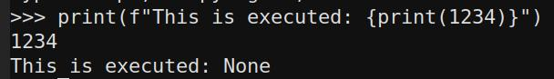
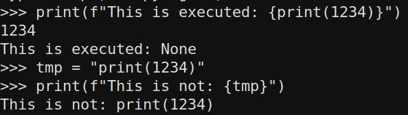
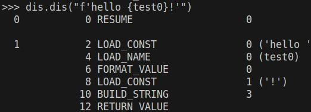
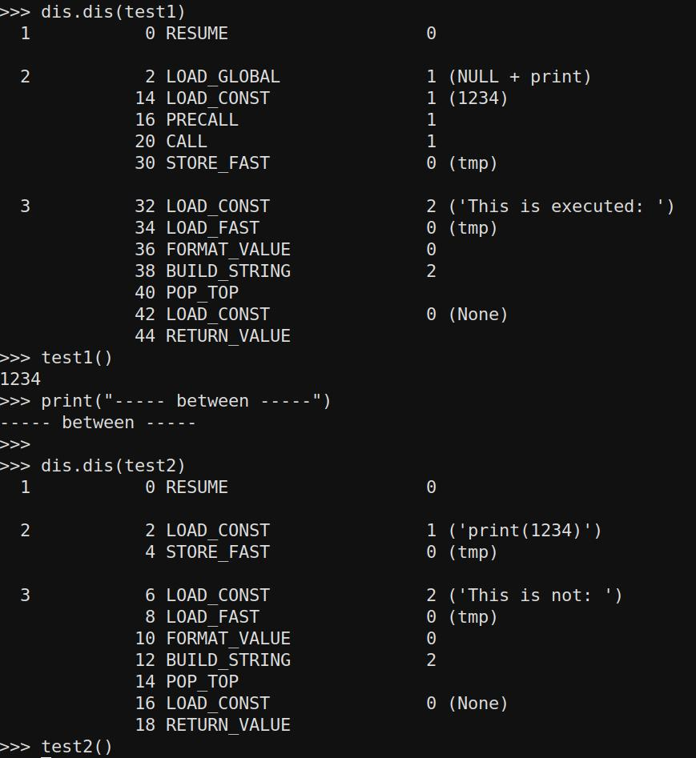
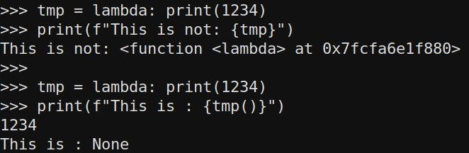

Title: Understanding Python f-Strings for RCE, Part 1
Date: 2023-06-15 22:00
Category: Pentest
Tags: Python, Eval, f-Strings

## What are Python f-Strings

Python f-strings, short for "formatted string literals," are a convenient way to embed expressions inside string literals, allowing for easy string interpolation. F-strings were introduced in Python 3.6 and provide a concise and readable syntax for creating formatted strings.

To create an f-string, you prefix the string literal with the letter "f" or "F" and enclose expressions inside curly braces {}. The expressions inside the curly braces are evaluated at runtime and their values are inserted into the resulting string. Here's an example:

```python
name = "Alice"
age = 25

# Using f-string to create a formatted string
message = f"My name is {name} and I'm {age} years old."
print(message)
```

## Why write about it?

Well, every now and then, we come across these functions in source code and discuss whether they pose a risk for Remote Code Execution (RCE) or not. There are links on the internet [1](https://www.geeksforgeeks.org/vulnerability-in-str-format-in-python/), [2](https://github.com/adeptex/CTF/blob/master/fstring-injection.md), and others that claim exploitability, while [others](https://security.stackexchange.com/questions/238338/are-there-any-security-concerns-to-using-python-f-strings-with-user-input) demonstrate that it is often not the case.

## Example Code

So lets review some snippets to see about the confusions.

```python
print(f"This is executed: {print(1234)}")
```


and

```python
tmp = "print(1234)"
print(f"This is not: {tmp}")
```



This might look very close to each other, but it seems python sees differences in it.
Before going on, we need to understand differences, before trying more techniques.

## Python under the Hood

To display the bytecode (disassembly) of a function in Python, you can utilize the dis module. The dis module offers a disassembler for Python bytecode, enabling you to examine the low-level instructions executed by the Python interpreter.

Lets do this for a new-style f-string:


What we can see here is that test0 is not a string constant, but being evaluated at runtime. Now this sounds like an eval() code, but lets do some tests to show you that its not so easy:

```python
import dis

def test1():
    tmp = print(1234)
    f"This is executed: {tmp}"

def test2():
    tmp = "print(1234)"
    f"This is not: {tmp}"

dis.dis(test1)
test1()
print("----- between -----")

dis.dis(test2)
test2()
```


In test one, we can observe that the print statement is executed, but it's important not to be misled. The execution of the print statement occurs during the variable declaration line. The value stored in tmp is None, and therefore our execution evaluation is performed on nothing (since it has already been executed).

In the second example, tmp is merely being formatted, and no function call occurs.

If we desire a mechanism to execute code from something like f"Exec {user_input}", we need a way to provide something that is not solely interpreted as a string (LOAD CONST).

### Further tests

We need to assign something to a variable that is interpreted as a function or something that triggers the execution of hidden code. I can envision two approaches to achieve this: using a lambda function or using a class.

```python
tmp = lambda: print(1234)
print(f"This is not: {tmp}")

tmp = lambda: print(1234)
print(f"This is : {tmp()}")
```


So we are not abe to place something executeable into an variable with this directly. But we can define a function call... no we cannot. The call is not part of the string evaluation, as we have seen in the beginning.

With a class, we can try something, but it is clear that instantiation leads to to same problems as before.
```python
class MyClass:
    def __init__(self):
        self.message = "Hello, World!"

tmp = MyClass 
print(f"This is : {tmp}")
print(f"This is : {tmp()}")
```

## Exploitable Case

Just like [here](https://security.stackexchange.com/questions/238338/are-there-any-security-concerns-to-using-python-f-strings-with-user-input) it is possible to exploit, but where is the difference in that example?

The example:
```python
from http.server import HTTPServer, BaseHTTPRequestHandler

secret = 'abc123'

class Handler(BaseHTTPRequestHandler):
    name = 'funtimes'
    msg = 'welcome to {site.name}'
    def do_GET(self):
        res = ('<title>' + self.path + '</title>\n' + self.msg).format(site=self)
        self.send_response(200)
        self.send_header('content-type', 'text/html')
        self.end_headers()
        self.wfile.write(res.encode())

HTTPServer(('localhost', 8888), Handler).serve_forever()
```

The difference is that the attacker actually controls the string that is going to be formatted.
So this line:

```python
res = ('<title>' + self.path + '</title>\n' + self.msg).format(site=self)
```
will be made into something we directly control, in the example to

```python
res = ('<title>' + 'XXX{site.do_GET.__globals__[secret]}' + '</title>\n' + self.msg).format(site=self)
```

From the provided example, people have been discussing whether the vulnerability could lead to Remote Code Execution (RCE). Let's examine what we can observe.

We have control over the left part of the code, but it is being formatted based on the condition set in the right part. The code expects and will not execute without exactly one pair of {}. It intends to format the site variable with the value of self. Consequently, the code will load 'self' into 'site' and then evaluate the code.

In the case of this code, this grants us full control over the Handler instance, and based on the provided solution, it is already established that accessing members is possible.

Python possesses numerous magical functionalities, but we will explore them in a subsequent post.

## Conclusion

It appears that there are specific cases in which formatting can lead to exploitable evaluation. Therefore, it is reasonable to consider the following approach: If the user input is parsed or manipulated only once, it is likely safe. However, if there are two or more manipulations, it might create the necessary side-effect.

Even in scenarios where a side-effect is present, it remains uncertain whether it is sufficient for a complete Remote Code Execution (RCE). As a result, further exploration and investigation will be conducted in part 2 to gain more insights.